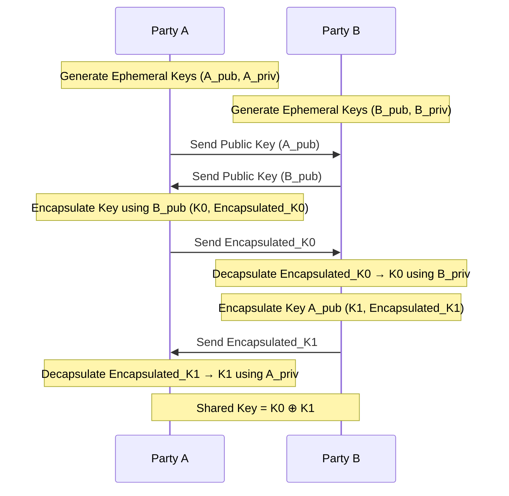

# Quantum MP-SPDZ

Integrates quantum-generated oblivious keys as Base OTs with the possibility of PSK combination to quantum-enable OT-Based Secure Multiparty Computation protocols.

The updates were carried out in the [`qdev`](https://github.com/diogoftm/QMP-SPDZ/tree/qdev) branch. This branch is based on [MP-SPDZ v0.4.0](https://github.com/data61/MP-SPDZ/tree/v0.4.0).

## Supported (tested) protocols

| Program | Protocol |
| --- | --- |
| `mascot-party.x` | [MASCOT](https://eprint.iacr.org/2016/505) |
| `semi-party.x` | Semi-honest version of [MASCOT](https://eprint.iacr.org/2016/505) |
| `yao-party.x` | Yao with half-gate garbling (see [Zahur et al.](https://eprint.iacr.org/2014/756.pdf) and [Guo et al.](https://eprint.iacr.org/2019/1168.pdf)) |

## Supported Key Retrieval interfaces

The current version supports the following KMS interfaces that are slightly modified for coexistence of both symmetric and oblivious keys (not in the scope of the original standards):
- [ETSI QKD 014](https://www.etsi.org/deliver/etsi_gs/QKD/001_099/014/01.01.01_60/gs_qkd014v010101p.pdf) ([Demo server/client](https://github.com/diogoftm/simulated-kms))
- [ETSI QKD 004](https://www.etsi.org/deliver/etsi_gs/QKD/001_099/004/02.01.01_60/gs_QKD004v020101p.pdf) ([Demo server/client](https://github.com/diogoftm/minimal-etsi-qkd-004))


## Installation and Example Usage

1. Clone this repository and install main dependencies:
    ```bash
    git clone https://github.com/diogoftm/QMP-SPDZ.git
    cd QMP-SPDZ
    git submodule update --init --recursive
    apt-get install -y automake build-essential clang cmake git libgmp-dev libntl-dev libsodium-dev libssl-dev libtool libboost-dev libjansson-dev yasm texinfo libexplain-dev libb64-dev
    ```
2. Set environment variables in `ENV.env` based on your infrastructure and then run:
    ```bash
    source ENV.sh
    ```
3. Build the library: 
    ```bash
    make -j 8 tldr
    ```
    Note: This command will rename either `OTKeys_014/` or `OTKeys_004/` to `OTKeys/` based on the `KEY_REQUEST_INTERFACE`.
    To change the interface, rename the directory back to its original name.
4. Compile, for example, the MASCOT executable `mascot-party.x`:
    ```bash
    make -j 8 mascot-party.x
    ```
5. Create a parties IP file:

   In this file it is defined the IP, port and SAE ID of each party in the computation, and also an optional PSK per peer. 

    The general structure of the file is the following:
   ```
    <IP>:<PORT> <SAE_ID> <KSID> <BASE_KEY_INDEX> <psk>
    <IP>:<PORT> <SAE_ID> <KSID> <BASE_KEY_INDEX> <psk>
    ...
   ```

    For 004, not only the IDs of the application need to be provided, but also the key stream ID and the index of the keys to be used need to be provided for each peer. For the 014 interface with the KMS only the SAE ID need to be set. The indicated key stream must have been already opened with a 4096-byte key chunk size. Also, a 256-bit base64 encoded PSK can be indicated that will be combined with the oblivious key received from the KMS. Key stream information (i.e. KSID and key index) are only used for the peers, so there's no need to indicate this information for the party that will use this file. 
    
    Example (SAE IDs 004 style and considering that this is the config file for party 0):
    ```
    # players_0.txt
    127.0.0.1:1234 qkd://app1@aaaaaaaa-aaaa-aaaa-aaaa-aaaaaaaaaaaa - - -
    127.0.0.1:1238 qkd://app2@bbbbbbbb-bbbb-bbbb-bbbb-bbbbbbbbbbbb 550e8400-e29b-41d4-a716-446655440000 0 -
    ```

    Example (SAE IDs 004 style and considering that this is the config file for party 1):
    ```
    # players_1.txt
    127.0.0.1:1234 qkd://app1@aaaaaaaa-aaaa-aaaa-aaaa-aaaaaaaaaaaa 550e8400-e29b-41d4-a716-446655440000 0 -
    127.0.0.1:1238 qkd://app2@bbbbbbbb-bbbb-bbbb-bbbb-bbbbbbbbbbbb - - -
    ```
7. Compile the MPC program (e.g. crash_detection_test):
    ```bash
    ./compile.py -F 64 crash_detection_test
    ```
8. Finally, run the computation (e.g. using mascot):
    ```bash
    ./mascot-party.x -N 2 -ip players_0.txt -I -p 0 crash_detection_test
    ./mascot-party.x -N 2 -ip players_1.txt -I -p 1 crash_detection_test
    ```

    For this computation just input 3 numbers separated by a space or by a new line. The first number is the flag (0 or 1) that tells if there was a crash or not, the other two number are the $(x, y)$ coordinates. The output will be the highest coordinate where a crash was indicated.

# Generate shared keys

Shared key generation is performed, if wished, before running the computation in order to set up the PSK filed in the respective parties file. 
This can be done using the `generate_shared_key.py` script that will perform an online key exchange using a Key Encapsulation Mechanism (KEM). Currently, the only supported KEM is [ML-KEM](https://csrc.nist.gov/pubs/fips/203/final) that will be used by default leveraging [BoringSSL](https://boringssl.googlesource.com/boringssl)'s implementation. 

For each party run:
```bash
python3 pq/generate_shared_key.py <ip-file-name> <playerno>
```

The script will also automatically update the respective parties file (`<ip-file-name>`) with the generated keys.

The flow of the key exchange between two parties is depicted in the diagram bellow.



This script should be seen only as an example basepoint to setup the PSKs using PQC and not as a finishd solution.

# More documentation

Please check the original MP-SPDZ [documentation](https://mp-spdz.readthedocs.io/en/v0.4.0/).